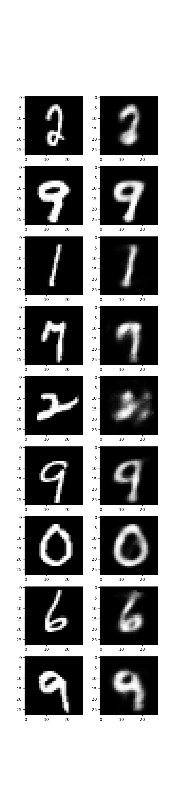
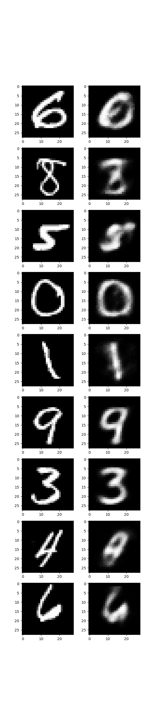
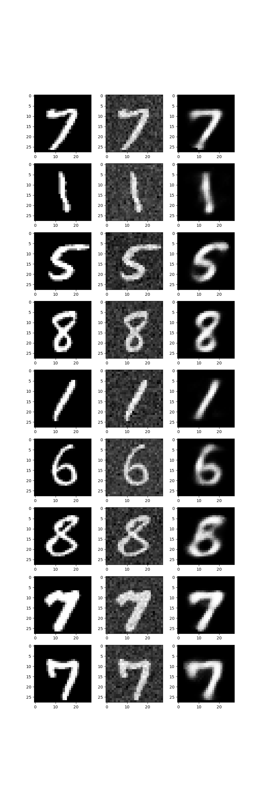
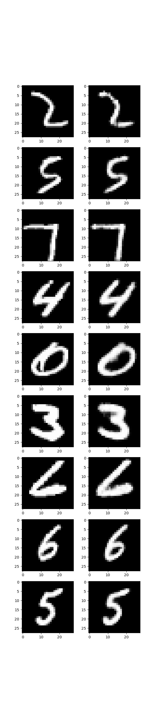

# Autoencoders

## Data

<br>

- MNIST

---

## Models

<br>

- Autoencoders

- Contractive Autoencoders

- Denoising  Autoencoders

- Convolutional Autoencoders

---

## How to use

<br>

`config.json`파일로 컨트롤이 가능합니다.

`model_type`으로 `AE`, `CAE`, `ConvAE` 설정이 가능합니다.

`denoising`을 1과 0의 값으로 `DAE`가 가능합니다.


- config 설정 후 학습
```
python3 main.py --mode train --gpu
```

<br>

- 학습 완료 후 테스트

```
python3 main.py --mode test --gpu --name {model name}
```

<br>

- 각 모델의 개념은 [여기](https://velog.io/@khs0415p/Auto-Encoders)에 정리 되어있습니다.

---

## results

<br>

- Autoencoders (Left: original, Right: output)


<br><br>


- Contractive Autoencoders (Left: original, Right: output)

<br><br>

- Denoising Autoencoders (Left: original, Middle: Noised, Right: output)

<br><br>


- Convolutional Autoencoders (Left: original, Right: output)


